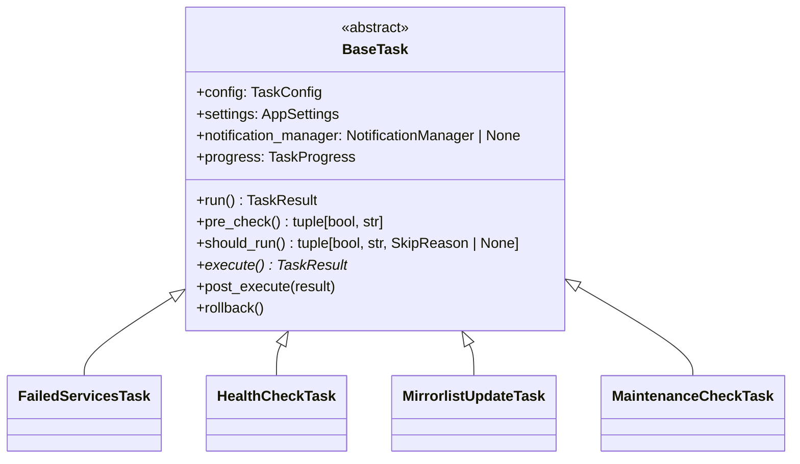
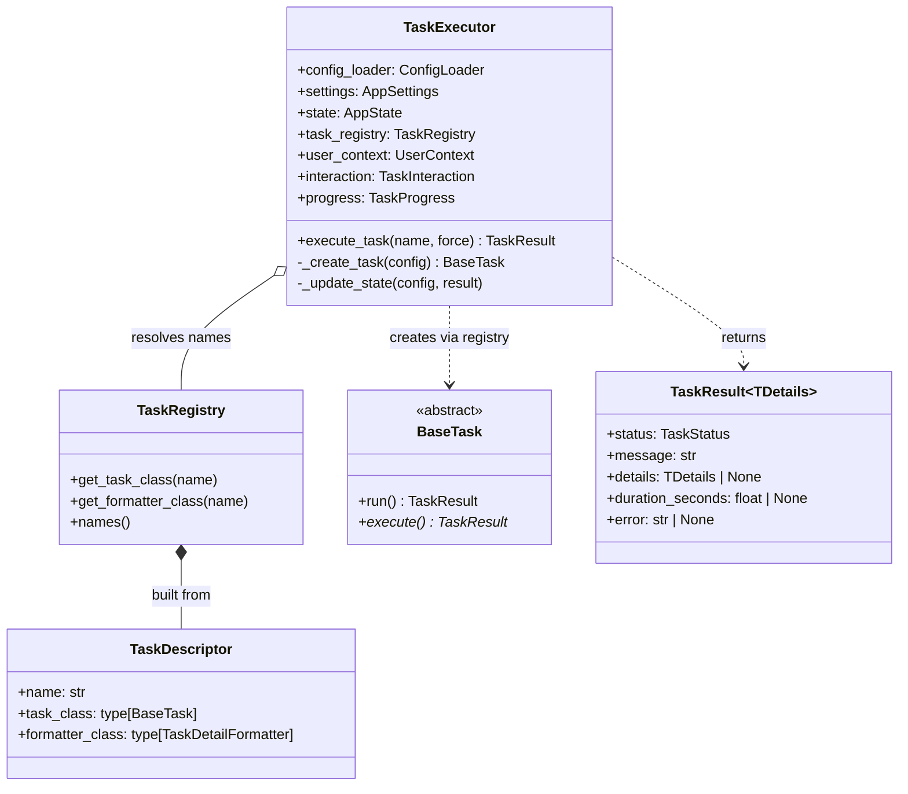
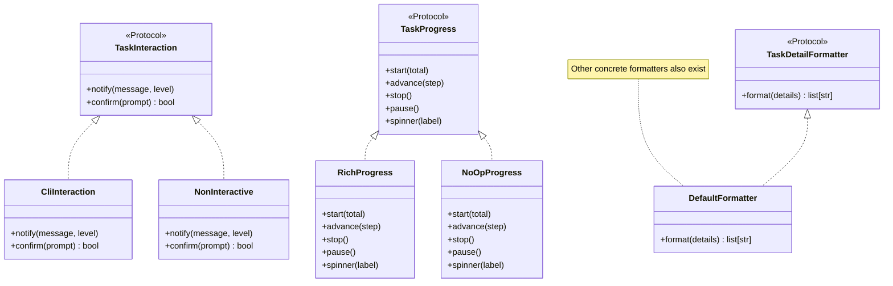
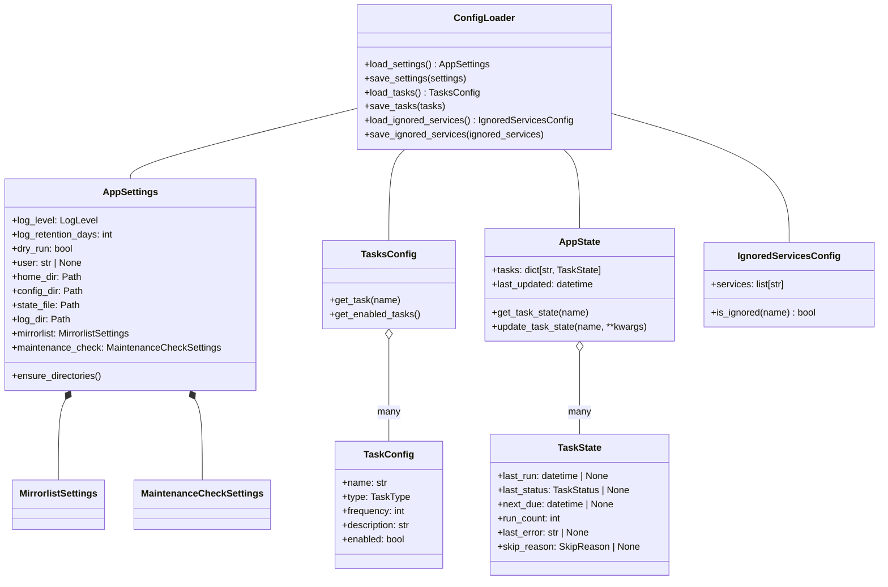
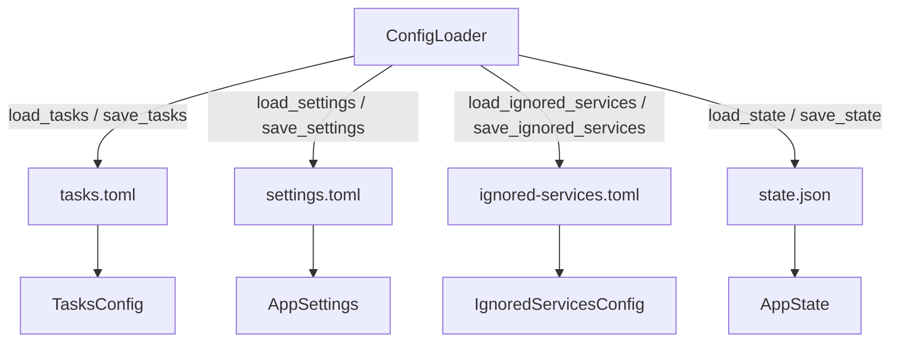
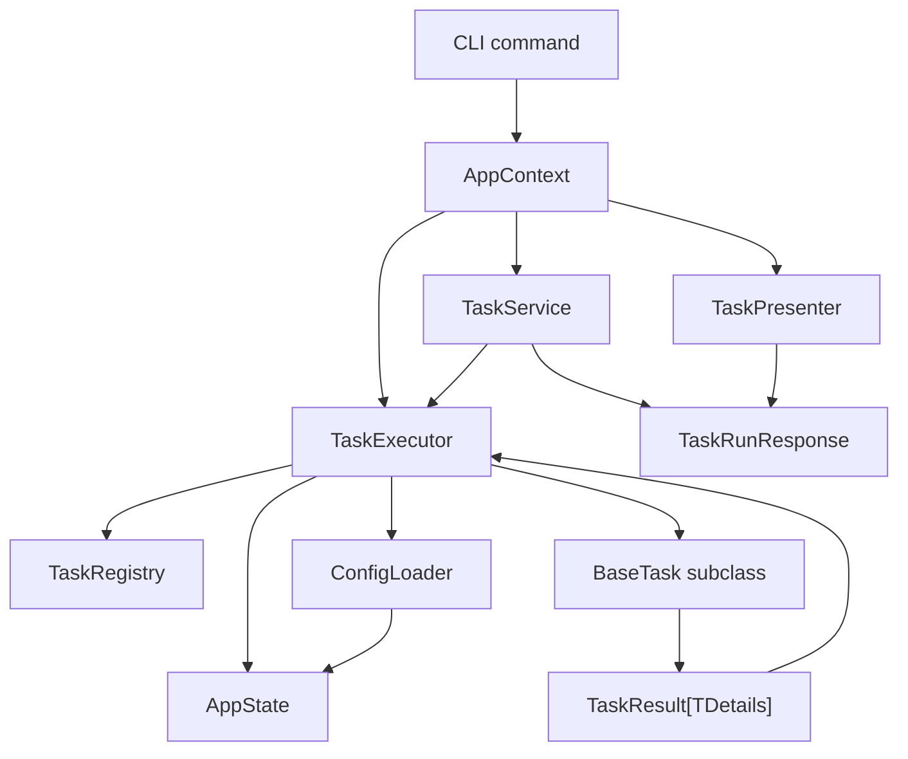
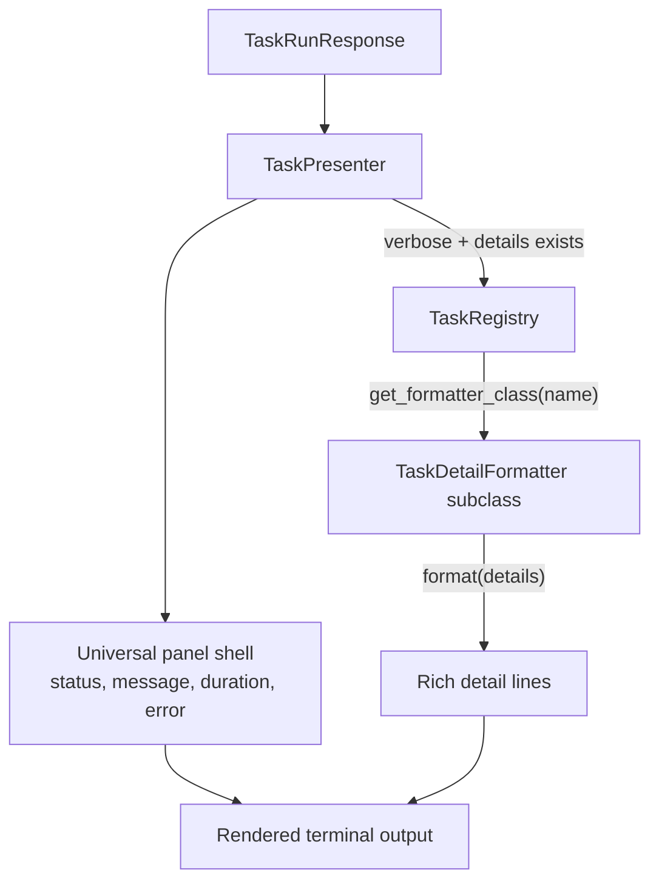

# Class Relationships

This page is the structural complement to the [Architecture Overview](index.md),
[Task Execution Lifecycle](task-lifecycle.md),
[Registry, ports & extensibility](registry-and-ports.md), and
[Configuration & state](configuration.md) pages. Where those pages explain flow, config, and wiring,
this page shows the static class relationships: inheritance, composition, delegation, and
port implementation.

Diagrams use [Mermaid](https://mermaid.js.org/) and match source-code names so every arrow can be
traced back to a real class or module.

## Diagram conventions

- **Solid arrow with hollow triangle** = inheritance / protocol implementation.
- **Solid arrow with hollow diamond** = aggregation (has-a).
- **Solid arrow with filled diamond** = composition / ownership.
- **Dashed arrow** = dependency / delegates-to.
- **Solid line** = association (two-way dependency).
- Participant names match the source exactly (`TaskExecutor`, `BaseTask`, `CliInteraction`,
  `AppState`, etc.).

## Task execution classes

Each concrete task is a thin subclass. The lifecycle contract lives in
[`BaseTask`][archcare.core.base_task.BaseTask]; tasks only override the hooks they need.

## Executor and registry

[`TaskExecutor`][archcare.core.executor.TaskExecutor] is the orchestrator. It never imports task
classes directly; it asks [`TaskRegistry`][archcare.core.task_registry.TaskRegistry] for them by
name. The registry is a mapping of task names to
[`TaskDescriptor`][archcare.core.task_registry.TaskDescriptor], which is assembled once in
[`AppContext`][archcare.cli.context.AppContext] and then passed to the executor. The executor
creates task instances by calling the `task_class` attribute of the descriptor. Formatters are
resolved separately at render time by
[`TaskPresenter`][archcare.cli.presenters.task_presenter.TaskPresenter] from the same registry. See
[task lifecycle](task-lifecycle.md) for details.

## Port protocols and CLI adapters

`core/` defines the ports; `cli/` provides the implementations. A future GUI would implement the
same three protocols without changing `core/` or `config/`.

## Config and state models

[`ConfigLoader`][archcare.config.loader.ConfigLoader] is the single gateway to persistence, but the
model relationships above are what it reads and writes.
[`AppSettings`][archcare.config.models.AppSettings] owns all computed paths;
[`AppState`][archcare.config.models.AppState] owns per-task history.

## ConfigLoader persistence contract

`ConfigLoader` is the single gateway to persistence. It maps each file to its
[Pydantic](https://pydantic.dev/) model type: `tasks.toml` ↔ `TasksConfig`,
`settings.toml` ↔ `AppSettings`, `ignored-services.toml` ↔
[`IgnoredServicesConfig`][archcare.config.models.IgnoredServicesConfig],
and `state.json` ↔ `AppState`.

## Services wiring

This is the wiring view: [`AppContext`][archcare.cli.context.AppContext] builds shared objects once,
commands construct one service, and the service delegates to the executor. Results flow back through
response DTOs to presenters.

## Presenter and formatter rendering

The presenter owns terminal rendering. It builds the universal shell itself, then delegates
domain-specific detail rendering to the task's registered formatter. This keeps task code free of
presentation concerns and preserves the core/config boundary.

## Related pages

- [Task Execution Lifecycle](task-lifecycle.md) — the runtime sequence that these classes
  participate in
- [Registry, ports & extensibility](registry-and-ports.md) — how task names resolve through
  the registry
- [Configuration & state](configuration.md) — the full config/state schema
