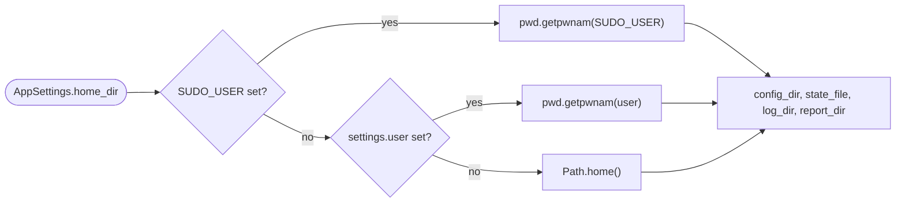
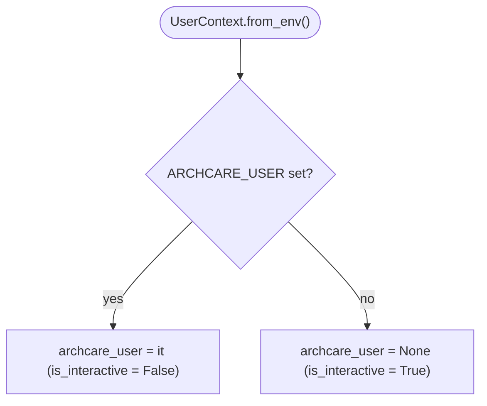

# Configuration & state

Archcare's **CONF** layer is the persistence boundary of the system: everything the user owns
(declarative TOML) and everything the machine owns (runtime JSON state) lives here, behind a single
gateway — [`ConfigLoader`][archcare.config.loader.ConfigLoader] — and a single enforcement point —
[Pydantic](https://pydantic.dev/) models. This page tours the models, the files they map to, and the
rules of the round-trip. The layer's import rule comes from the [architecture overview](overview.md):
**CONF** never imports from **CLI** or **SVC**.

## The big split: config vs. state

Two kinds of data, two kinds of ownership:

|               | Declarative config                                           | Runtime state                                        |
| ------------- | ------------------------------------------------------------ | ---------------------------------------------------- |
| Files         | `tasks.toml`, `settings.toml`, `ignored-services.toml`       | `state.json`, per-task log and report files          |
| Format        | TOML via [tomlkit](https://github.com/python-poetry/tomlkit) | JSON (`model_dump(mode="json")`)                     |
| Owner         | The user — hand-editable, comments preserved                 | The machine — written after every task run           |
| Damage policy | Falls back to defaults; **never rewritten** for you to fix   | Regenerated fresh; the next write rebuilds it        |
| Written by    | Bootstrap and explicit saves only                            | `TaskExecutor._update_state()` after every execution |

The rest of the page follows this split: first the files, then the models (file by file), then the
loader, then the bootstrap path.

## The file map

| File                    | Location                   | Schema model                                                            |
| ----------------------- | -------------------------- | ----------------------------------------------------------------------- |
| `tasks.toml`            | `~/.config/archcare/`      | [`TasksConfig`][archcare.config.models.TasksConfig]                     |
| `settings.toml`         | `~/.config/archcare/`      | [`AppSettings`][archcare.config.models.AppSettings]                     |
| `ignored-services.toml` | `~/.config/archcare/`      | [`IgnoredServicesConfig`][archcare.config.models.IgnoredServicesConfig] |
| `state.json`            | `~/.local/state/archcare/` | [`AppState`][archcare.config.models.AppState]                           |

Two sibling directories are derived from [`AppSettings`][archcare.config.models.AppSettings] path
properties rather than configured: `~/.local/state/archcare/logs/` (global + per-task logs) and
`~/.local/state/archcare/reports/` (`maintenance-check` reports).

Where those directories actually resolve is decided once, in
[`AppSettings.home_dir`][archcare.config.models.AppSettings.home_dir]:



Every computed path is derived from `home_dir` (`config_dir` = `<home>/.config/archcare`,
`state_file` = `<home>/.local/state/archcare/state.json`, and so on), validated as absolute and
resolvable by the
[`validate_paths`][archcare.config.models.AppSettings.validate_paths] model validator, and created
idempotently by [`ensure_directories`][archcare.config.models.AppSettings.ensure_directories].
User lookup goes through `pwd.getpwnam` with a `/home/<user>` fallback; a nonexistent user raises
[`HomeDirectoryResolutionError`][archcare.config.exceptions.HomeDirectoryResolutionError].

The `SUDO_USER` box in that figure is a raw environment lookup made inside the model — not a
`UserContext` decision. See [that](#usercontext-who-am-i-running-as) section for the two
unrelated places `SUDO_USER` is actually consumed.

## The model tour

[Pydantic](https://docs.pydantic.dev/) models are the single enforcement point across both kinds of
persistence: every file in the map above parses into a model, every default lives in a model field,
and every rule lives in a model validator. One subsection per file.

### `tasks.toml` — what to run

[`TaskConfig`][archcare.config.models.TaskConfig] is the schema for one task definition.

| Field         | Type                                                      | Default      | Rule                                                                                                              |
| ------------- | --------------------------------------------------------- | ------------ | ----------------------------------------------------------------------------------------------------------------- |
| `name`        | `str`                                                     | **required** | Charset-validated task identifier; must match the [registry](registry-and-ports.md#where-the-registry-lives) name |
| `task_type`   | <code> [TaskType][archcare.config.enums.TaskType] </code> | **required** | TOML key is `type` (Pydantic `alias`); serialized back as a string                                                |
| `frequency`   | `int`                                                     | **required** | Days between runs; must be `> 0`                                                                                  |
| `description` | `str`                                                     | **required** | Human-readable summary shown by `task list`                                                                       |
| `enabled`     | `bool`                                                    | `True`       | `False` → the executor skips the task with `SkipReason.DISABLED`                                                  |

The in-TOML key for the type field is `type`, not `task_type`:

```toml title="tasks.toml"
[health-check]
name = "health-check"
type = "manual"
frequency = 30
description = "Disk, memory, CPU, filesystem and pacman database checks"
```

[`TasksConfig`][archcare.config.models.TasksConfig] wraps the dict of `TaskConfig` entries and adds
the query helpers the services layer uses:
[`get_enabled_tasks()`][archcare.config.models.TasksConfig.get_enabled_tasks],
[`get_tasks_by_type()`][archcare.config.models.TasksConfig.get_tasks_by_type],
[`get_task()`][archcare.config.models.TasksConfig.get_task].

### `settings.toml` — how to run

[`AppSettings`][archcare.config.models.AppSettings] holds the global knobs plus the nested settings
groups, and is the source of every computed path on the system.

| Field                | Type                                                                          | Default        | Purpose                                                             |
| -------------------- | ----------------------------------------------------------------------------- | -------------- | ------------------------------------------------------------------- |
| `log_level`          | <code> [LogLevel][archcare.config.enums.LogLevel] </code>                     | `INFO`         | Global loguru level (values in the [enums table](#the-enums))       |
| `log_retention_days` | `int`                                                                         | `30`           | Global log rotation window (days)                                   |
| `dry_run`            | `bool`                                                                        | `False`        | Preview mode threaded through task execution                        |
| `user`               | <code>str &#124; None</code>                                                  | `None`         | Target username; feeds the `home_dir` ladder [above](#the-file-map) |
| `mirrorlist`         | [`MirrorlistSettings`][archcare.config.models.MirrorlistSettings]             | model defaults | Settings specific to the `mirrorlist-update` task                   |
| `maintenance_check`  | [`MaintenanceCheckSettings`][archcare.config.models.MaintenanceCheckSettings] | model defaults | Settings specific to the `maintenance-check` task                   |

The path properties (`home_dir`, `config_dir`, `state_file`, `log_dir`, `report_dir`) are computed,
excluded from serialization, and covered [above](#the-file-map).

[`MirrorlistSettings`][archcare.config.models.MirrorlistSettings] configures the `reflector` run:
`country` (a single country or a list), `protocol` (`http` / `https` / `rsync`), `sort` (validated
against a fixed allowlist), the `latest` / `number_of_mirrors` count caps, and the mirrorlist
`path` — serialized to a string on save for TOML compatibility.

[`MaintenanceCheckSettings`][archcare.config.models.MaintenanceCheckSettings] configures the
"what's due" report: `critical_threshold_days` / `warning_threshold_days` (overdue severity),
`output_mode` (`terminal` / `file` / `both`), `show_notifications` gated by `notification_level`
(`info` / `warning` / `critical` minimum severity), `report_retention_days`, and
`require_acknowledgment` for critical issues.

### `ignored-services.toml` — what to forgive

[`IgnoredServicesConfig`][archcare.config.models.IgnoredServicesConfig] is the list of systemd units
[`FailedServicesTask`][archcare.tasks.failed_services.FailedServicesTask] excludes from its failure
check. It holds a single `services` field, validated per unit name: offending entries are collected
and reported via [`InvalidUnitNameError`][archcare.config.exceptions.InvalidUnitNameError] rather
than failing on the first bad value.
[`is_ignored()`][archcare.config.models.IgnoredServicesConfig.is_ignored] answers the exclusion
question at run time.

### `state.json` — what has happened

[`TaskState`][archcare.config.models.TaskState] is the per-task execution record — six fields:

| Field         | Type                                                                    | Meaning                                                                                             |
| ------------- | ----------------------------------------------------------------------- | --------------------------------------------------------------------------------------------------- |
| `last_run`    | <code>datetime &#124; None</code>                                       | Timestamp of last execution                                                                         |
| `last_status` | <code>[TaskStatus][archcare.config.enums.TaskStatus] &#124; None</code> | Outcome of last execution                                                                           |
| `next_due`    | <code>datetime &#124; None</code>                                       | `now()` + `frequency` days; set on success, preserved on skip/failure, cleared on a `DISABLED` skip |
| `run_count`   | `int`                                                                   | Total executions (`>=0`)                                                                            |
| `last_error`  | <code>str &#124; None</code>                                            | Error message when `last_status` is `FAILURE`                                                       |
| `skip_reason` | <code>[SkipReason][archcare.config.enums.SkipReason] &#124; None</code> | Reason when `last_status` is `SKIPPED`                                                              |

Datetimes serialize as ISO 8601 strings in `state.json` and are parsed back on startup.
[`AppState`][archcare.config.models.AppState] is the root document: a
<code>dict[str, [`TaskState`][archcare.config.models.TaskState]]</code> keyed by task name plus
`last_updated`, with lazy [`get_task_state()`][archcare.config.models.AppState.get_task_state]
creation and [`update_task_state()`][archcare.config.models.AppState.update_task_state] — the single
mutation entry point.

!!! note "Who writes, who reads"

    `TaskExecutor._update_state()`, which internally calls `AppState.update_task_state()`, is the
    only thing that writes after every execution — success, failure, or skip.
    [`TaskScheduler`][archcare.core.scheduler.TaskScheduler] reads `last_run` / `next_due` to decide
    what's due. Nobody else touches the file. See figure 2 of
    [Task Execution Lifecycle](task-lifecycle.md#inside-the-executor-gates-and-branching) page for
    details.

### The enums

All four live in [`archcare.config.enums`][], separate from the models:

| Enum                                             | Values                                                                                  | Surfaces in                                |
| ------------------------------------------------ | --------------------------------------------------------------------------------------- | ------------------------------------------ |
| [`TaskType`][archcare.config.enums.TaskType]     | `AUTOMATED`, `MANUAL`                                                                   | `tasks.toml` `type`; `task list --type`    |
| [`TaskStatus`][archcare.config.enums.TaskStatus] | `SUCCESS`, `FAILURE`, `SKIPPED`, `PARTIAL`                                              | `state.json`; `task status` output         |
| [`SkipReason`][archcare.config.enums.SkipReason] | `NO_WORK_NEEDED`, `DISABLED`, `DEPENDENCY_FAILED`, `USER_CANCELLED`, `NOT_DUE`, `OTHER` | `state.json` skip records; `task status`   |
| [`LogLevel`][archcare.config.enums.LogLevel]     | `DEBUG`, `INFO`, `WARNING`, `ERROR`, `CRITICAL`                                         | `settings.toml` `log_level`; log filtering |

### UserContext: who am I running as

[`UserContext`][archcare.config.user.UserContext] is the CONF layer's identity module — a frozen
dataclass with a single field, `archcare_user`, read once per invocation from the `ARCHCARE_USER`
environment variable (the systemd service units set it to the target user). `is_interactive` is
just "`ARCHCARE_USER` is unset": interactive CLI run vs. scheduled timer run.



`UserContext` is threaded into the executor and the loader, where it drives
[`chown_if_root()`][archcare.config.user.UserContext.chown_if_root] — the helper that keeps
`state.json` owned by the target user when archcare runs as root under a systemd timer.

!!! warning "`SUDO_USER` is consumed in two unrelated places — and never by `UserContext`"

    `SUDO_USER` never reaches `UserContext`, but it is not ignored either:

    - **Implicitly, everywhere**:
        [`AppSettings.home_dir`][archcare.config.models.AppSettings.home_dir]
        checks `SUDO_USER` *first* in its resolution ladder. Any command run under sudo therefore
        resolves every path to the invoking user's home — even when `settings.user` is also set,
        which silently loses that comparison.
    - **Explicitly, only in `setup timers`**: `resolve_systemd_target_user()`
        (`services/setup_service.py`) reads `SUDO_USER` to pick the non-root user the systemd units
        should run as, and that value feeds `AppContext.executor_for_user()` (`cli/context.py`) —
        the only code path that scopes the loader and logging to a named user.

    In that sudo flow `ARCHCARE_USER` is never consulted: it is always unset under `sudo` anyway,
    and the timers flow needs the *invoking* user, not the systemd target. Everywhere else,
    `ARCHCARE_USER` — via `UserContext` — is the explicit override, and `SUDO_USER`'s only effect
    is the implicit `home_dir` ladder above.

Briefly, identity aside: [`archcare.config.logging`][archcare.config.logging] owns global and
per-task loguru setup — sinks, rotation by `log_retention_days`, per-task handlers added and
removed inside [`BaseTask.run`][archcare.core.base_task.BaseTask.run]. See
[this](task-lifecycle.md#run-orchestration) section for a detailed breakdown.

## Persistence: ConfigLoader

[`ConfigLoader`][archcare.config.loader.ConfigLoader] is the single gateway to both kinds of
persistence. Constructed with an optional `user` (file ownership) and `config_dir` override — both
defaulted from [`AppSettings`][archcare.config.models.AppSettings] — it creates the config
directory on init and exposes a symmetric API:

| Method (pairs)                                    | File                    | Format |
| ------------------------------------------------- | ----------------------- | ------ |
| `load_tasks` / `save_tasks`                       | `tasks.toml`            | TOML   |
| `load_settings` / `save_settings`                 | `settings.toml`         | TOML   |
| `load_ignored_services` / `save_ignored_services` | `ignored-services.toml` | TOML   |
| `load_state` / `save_state`                       | `state.json`            | JSON   |

Plus one asymmetric convenience:
[`load_default_settings()`][archcare.config.loader.ConfigLoader.load_default_settings] — a fresh
[`AppSettings`][archcare.config.models.AppSettings] that never touches disk.

Saves go through `_patch_document` (a private module-level helper): the on-disk TOML is parsed into
a [tomlkit](https://github.com/python-poetry/tomlkit) document seeded from the
[defaults](#bootstrap-defaults) builders, then only the model's values are patched in. User
comments and formatting survive the round-trip; new keys are appended into the existing structure.

### Failure symmetry, ownership asymmetry

Every load method handles damage identically — missing, empty, and corrupt files are all logged and
degrade to a fresh default model (the four `ValidationError` catch sites in
[`loader.py`][archcare.config.loader.ConfigLoader]):

| File damaged            | Load result                                                                   |
| ----------------------- | ----------------------------------------------------------------------------- |
| `tasks.toml`            | Empty [`TasksConfig`][archcare.config.models.TasksConfig]                     |
| `settings.toml`         | Defaults [`AppSettings`][archcare.config.models.AppSettings]                  |
| `ignored-services.toml` | Empty [`IgnoredServicesConfig`][archcare.config.models.IgnoredServicesConfig] |
| `state.json`            | Fresh [`AppState`][archcare.config.models.AppState]                           |

But what happens _next_ differs by kind — the ownership asymmetry from the top of this page:

!!! note "State regenerates; config is never rewritten"

    A damaged `state.json` self-heals: the next `save_state()` rebuilds it from live results,
    losing only history. A damaged TOML file does **not** self-heal: the loader keeps returning
    the fallback model in memory, but never writes it back — your broken file stays on disk
    untouched until _you_ fix it or run `archcare setup config` and answer `y` to the
    overwrite prompt. A silent rewrite would destroy the very comments
    [`_patch_document`](#persistence-configloader) exists to preserve.

!!! warning "Overwriting with `archcare setup config`"

    Please note that answering `y` to the overwrite prompt will overwrite **all** of your
    other config files, not just the one you broke. Consider backing up those files before
    doing so.

## Bootstrap: defaults

The three builders in [`archcare.config.defaults`][] builds each initial TOML document as commented
[tomlkit](https://github.com/python-poetry/tomlkit) structures — the generated files are the primary
documentation of every setting.
[`create_default_config_files()`][archcare.config.loader.create_default_config_files] writes all
three config files at once; the user-facing entry point is `archcare setup config` →
[`ConfigService`][archcare.services.setup_service.ConfigService], which declines to clobber
existing files.

The default task catalog:

| Task                | Type        | Frequency (days) |
| ------------------- | ----------- | ---------------- |
| `maintenance-check` | `automated` | 1                |
| `mirrorlist-update` | `automated` | 7                |
| `journal-cleanup`   | `automated` | 30               |
| `btrfs-scrub`       | `automated` | 30               |
| `system-update`     | `manual`    | 7                |
| `orphan-removal`    | `manual`    | 30               |
| `cache-cleanup`     | `manual`    | 30               |
| `pacnew-review`     | `manual`    | 30               |
| `failed-services`   | `manual`    | 30               |
| `health-check`      | `manual`    | 30               |
| `disk-space-review` | `manual`    | 90               |

## Adding a new setting

Settings round-trip automatically once they exist in a model; only two edits are ever needed:

1. **Model field + validator** — add the field (with a default) to the relevant model in
   [`config/models.py`][archcare.config.models], and any rule as a
   [`field_validator`](https://docs.pydantic.dev/latest/concepts/validators/). Paths must stay
   absolute — `validate_paths` enforces it document-wide.
2. **Default document** — add the key (with a comment) to the matching builder in
   [`config/defaults.py`][archcare.config.defaults]. The generated TOML is the
   setting's documentation; an uncommented key is a bug.

No loader changes: `_patch_document` picks up new keys on the next save, and unknown keys in old
files are ignored on load (Pydantic default behavior).

## Validation philosophy

Validators are the enforcement point for every rule on this page: `frequency > 0`, absolute paths,
unit-name charset, reflector sort allowlist. And like the rest of CONF, the exceptions follow the
[project-wide hierarchy](overview.md) rooted in
[`ArchcareError`][archcare.exceptions.ArchcareError] — with one deliberate quirk:
[`UnknownTaskError`][archcare.config.exceptions.UnknownTaskError],
[`HomeDirectoryResolutionError`][archcare.config.exceptions.HomeDirectoryResolutionError], and
[`InvalidUnitNameError`][archcare.config.exceptions.InvalidUnitNameError] also subclass
`ValueError`.
CONF exceptions that must pass through Pydantic validators inherit `ValueError` on purpose —
Pydantic only converts `ValueError` (and `AssertionError`) raised inside validators into
[`ValidationError`](https://docs.pydantic.dev/latest/errors/validation_errors/), so the domain type
survives the crossing while staying catchable as `ArchcareError` everywhere else.

## Related pages

- [Task lifecycle](task-lifecycle.md) — the execution loop that reads this config and writes
  this state
- [Registry, ports & extensibility](registry-and-ports.md) — how task names resolve against the
  registry
- [Architecture overview](overview.md) — the layered architecture and where **CONF** layer sits
  in it
