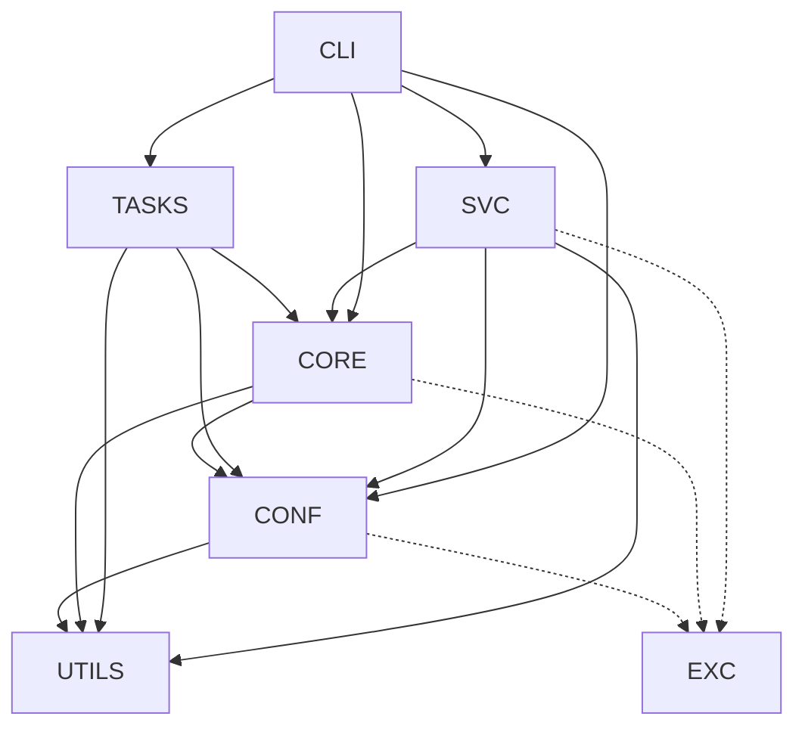

# Architecture Overview

Archcare is organized as a strictly layered architecture. Every layer has a single responsibility,
and dependencies only ever point "downward" — from presentation toward plumbing, never the other
way around. This keeps the business logic testable in isolation, makes each layer replaceable,
and is what will let a future GUI frontend reuse the core unmodified.

## The big picture

The diagram below shows the actual import relationships between the layers (Arrows point _at_
the layer being used):

Two rules make this diagram work as a contract:

1. **_CORE_ and _CONF_ never import from _CLI_ or _SVC_.** The engine and the configuration layer
   are presentation-agnostic. Everything they need from the "outside world" arrives either as
   constructor arguments or through the [port protocols](registry-and-ports.md).
2. **_UTILS_ is the only code that talks to the OS directly.** Subprocess invocation, hardware
   queries, and pacman/mirrorlist inspection all live here, behind a small, heavily mocked surface
   (`run_command` / `run_command_with_sudo`). Every other layer is testable without ever touching
   a real shell.

## The layers

### **CLI** — presentation

[Typer](https://typer.tiangolo.com/) commands, [Rich](https://github.com/Textualize/rich) terminal
rendering, and the CLI-side implementations of the core ports. The root
[`callback`][archcare.cli.app.callback] builds an [`AppContext`][archcare.cli.context.AppContext]
once per invocation and threads it down through `ctx.obj`; commands stay thin — they construct a
service from the context, delegate all logic, and render the response.

Key modules: [`app`][archcare.cli.app] (root assembly), [`context`][archcare.cli.context]
(per-invocation context and the `DEFAULT_TASK_REGISTRY` constant),
[`commands`][archcare.cli.commands] (one sub-app per command group),
[`presenters`][archcare.cli.presenters] (response rendering and per-task detail formatters),
[`interaction`][archcare.cli.interaction] / [`progress`][archcare.cli.progress]
(port implementations).

### **SVC** — orchestration

One service per command group, each owning the business logic of its commands: validating inputs
early, delegating to **CORE** machinery, and packaging results into response DTOs
([`responses`][archcare.services.responses]) so presenters never touch raw business state. Services
also translate low-level core exceptions into user-actionable service-layer errors.

Key modules: [`TaskService`][archcare.services.task_service.TaskService] (run / list / status),
[`ConfigService`][archcare.services.setup_service.ConfigService] and
[`TimerService`][archcare.services.setup_service.TimerService] (first-time setup and systemd timer
installation), [`DebugService`][archcare.services.debug_service.DebugService] (diagnostics).

### **TASKS** — task implementations

One module per maintenance task, each a thin subclass of
[`BaseTask`][archcare.core.base_task.BaseTask] implementing the task lifecycle hooks (see the
[task lifecycle](task-lifecycle.md) page). Tasks contain _what_ to check or do — never _how_ it's
scheduled, rendered, or persisted.

### **CORE** — engine

The execution engine and the domain model. [`TaskExecutor`][archcare.core.executor.TaskExecutor]
instantiates tasks from the registry, drives the [`BaseTask`][archcare.core.base_task.BaseTask]
pipeline, and records state; [`TaskScheduler`][archcare.core.scheduler.TaskScheduler] decides what
is due. [`TaskResult[TDetails]`][archcare.core.models.TaskResult] carries typed per-task details
end to end. The port protocols ([`TaskInteraction`][archcare.core.interaction.TaskInteraction],
[`TaskProgress`][archcare.core.progress.TaskProgress],
[`TaskDetailFormatter`][archcare.core.formatter.TaskDetailFormatter]) are defined here — see
[Registry, ports & extensibility](registry-and-ports.md).

### **CONF** — configuration & state

[Pydantic](https://pydantic.dev/) models, TOML/JSON loading and persistence, default document
builders, logging setup, and user-context resolution
([`UserContext`][archcare.config.user.UserContext], which handles running as root under systemd
timers). See [Configuration & state](configuration.md) for the model tour.

### **UTILS** — the OS boundary

[`system`][archcare.utils.system] (subprocess wrappers — the _only_ place that spawns processes),
[`hardware`][archcare.utils.hardware] (psutil queries), and the pacman/mirrorlist domain helpers.
Everything above this layer can be tested without a real system underneath.

### **EXC** — one root exception

Every layer defines its own domain exceptions, all rooted in
[`ArchcareError`][archcare.exceptions.ArchcareError]. Callers can catch everything archcare-related
with a single clause while still handling specific failure modes precisely.

## Design philosophy

### Dependency injection throughout

There is no global state and no import-time side effect to reach for.
[`AppContext`][archcare.cli.context.AppContext] builds a
[`TaskExecutor`][archcare.core.executor.TaskExecutor] once per invocation and hands it to whichever
service needs it. This is why integration tests can build a real context against a temp directory
and exercise the real wiring.

### Ports for anything environment-specific

Wherever core code would otherwise depend on a terminal — asking the user a question, showing
progress, rendering a task's details — the dependency is inverted through a duck-typed protocol in
**CORE**, with the CLI/GUI providing the implementation. This is the seam that keeps the door open
for a non-CLI frontend; it is documented in detail on the [ports page](registry-and-ports.md).

### One static registry

Task name → execution class → detail formatter is resolved in exactly one place:
[`TaskRegistry`][archcare.core.task_registry.TaskRegistry], populated by the
`DEFAULT_TASK_REGISTRY` constant in [`archcare.cli.context`][archcare.cli.context]. Adding a task
is a registration, not a scattering of changes — see the
[adding-a-task guide](../guides/adding-a-task.md).

### Typed task results

Tasks return [`TaskResult[TDetails]`][archcare.core.models.TaskResult], generic over a frozen
per-task dataclass (`FailedServicesDetails`, `HealthCheckDetails`, etc.). Results flow to
presenters as real, attribute-accessed data instead of loosely-keyed dicts, so a formatter typo
is a type error, not a silently blank field.

### A real exception hierarchy

Layer-local exceptions rooted in a single [`ArchcareError`][archcare.exceptions.ArchcareError];
**CORE**/**CONF** exceptions that must pass through Pydantic validators deliberately also subclass
`ValueError`. Errors are part of each layer's public contract, not an afterthought of bare
`Exception` raises.
