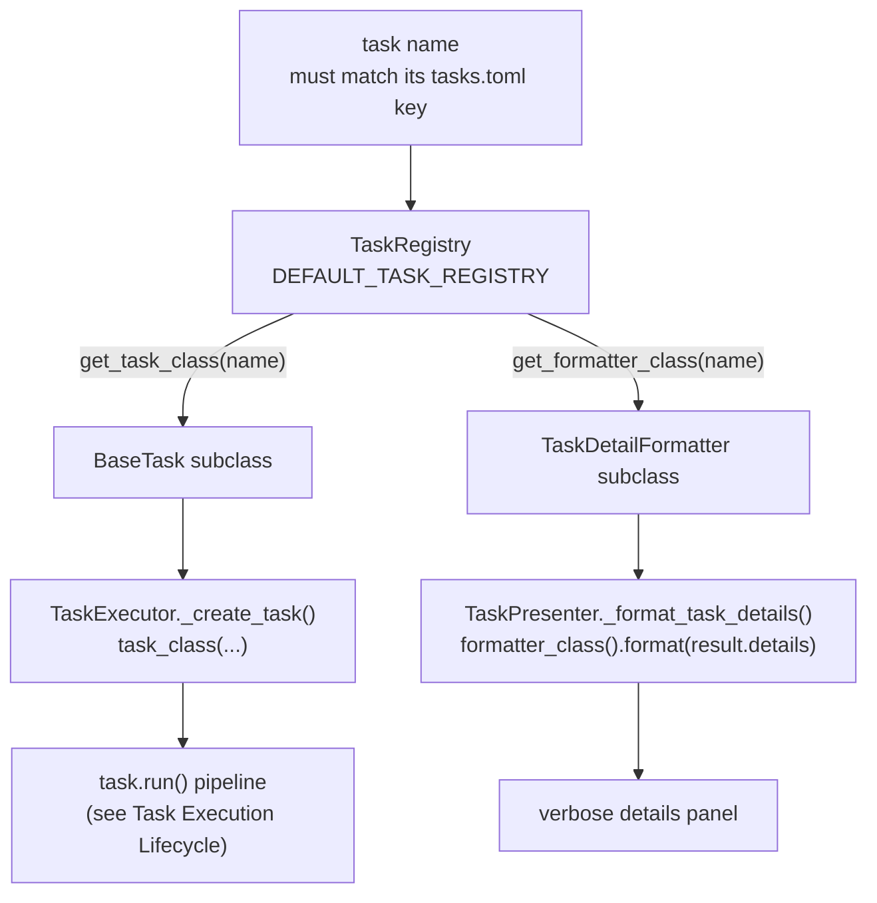

# Registry, Ports & Extensibility

This page documents the two mechanisms that make Archcare's layering contract real: the **static
registry** that resolves a task name to its execution class and detail formatter, and the **port
protocols** that keep `core/` free of presentation code. Where the
[Task Execution Lifecycle](task-lifecycle.md) page follows a run through the pipeline, this page
shows the wiring underneath it — the seams a future GUI frontend would plug into.

If you have just read [Architecture Overview](overview.md): overview explains _why_ the layers and
seams exist; this page is the reference for what each seam actually looks like in source.

## The registry

### One static source of truth

Task name to execution class and detail formatter mapping is done in exactly one place:
[`TaskRegistry`][archcare.core.task_registry.TaskRegistry]. A registry is built from a tuple of
[`TaskDescriptor`][archcare.core.task_registry.TaskDescriptor] records — frozen dataclasses with
three fields:

- **`name`** — the task's identifier. It must match the task's key in `tasks.toml` (the
  [`TaskConfig`][archcare.config.models.TaskConfig] `name` field) and the string used on the
  command line.
- **`task_class`** — the [`BaseTask`][archcare.core.base_task.BaseTask] subclass that implements
  the task's pipeline.
- **`formatter_class`** — an optional [`TaskDetailFormatter`][archcare.core.formatter.TaskDetailFormatter]
  implementation for rendering the task's details. Omitting it selects the generic
  [`DefaultFormatter`][archcare.core.formatter.DefaultFormatter].

The registry normalizes the descriptor tuple into a dict for O(1) lookups and exposes three
accessors: [`get_task_class()`][archcare.core.task_registry.TaskRegistry.get_task_class],
[`get_formatter_class()`][archcare.core.task_registry.TaskRegistry.get_formatter_class], and
[`names()`][archcare.core.task_registry.TaskRegistry.names]. Both getters raise
[`TaskNotRegisteredError`][archcare.core.exceptions.TaskNotRegisteredError] for an unknown name,
listing the names that _are_ registered — which makes a typo self-diagnosing.

### Where the registry lives

The production registry is the module-level `DEFAULT_TASK_REGISTRY` constant in
[`archcare.cli.context`][archcare.cli.context]:

```python
DEFAULT_TASK_REGISTRY = TaskRegistry(
    (
        TaskDescriptor("failed-services", FailedServicesTask, FailedServicesFormatter),
        TaskDescriptor("health-check", HealthCheckTask, HealthCheckFormatter),
        TaskDescriptor("mirrorlist-update", MirrorlistUpdateTask, MirrorlistUpdateFormatter),
        TaskDescriptor("maintenance-check", MaintenanceCheckTask, MaintenanceCheckFormatter),
    )
)
```

The registry _type_ belongs to core; the _constant_ is a CLI-layer assembly detail, sitting next
to the CLI adapters it names. A GUI frontend would define its own constant with its own formatters
and pass it to [`TaskExecutor`][archcare.core.executor.TaskExecutor] — nothing in core or config
would change.

Note the two failure modes this design separates: a name in `tasks.toml` that isn't registered
fails in `TaskExecutor._create_task()` (a private helper) with `TaskNotRegisteredError`, while
a registered name that isn't configured fails earlier in
[`TaskService`][archcare.services.task_service.TaskService] with
[`UnknownTaskError`][archcare.config.exceptions.UnknownTaskError]. The two lists must agree for
a task to run at all.

### How a name routes to a class and a formatter

See _figure 1_.



- _figure 1_ — one name, two routing destinations

The two destinations have different lifecycles. The **execution class** is instantiated once per
run by the executor, wired with the run's shared settings, notification manager, and progress
port, and driven through the full pipeline. The **formatter class** is instantiated per render and
called exactly once — and only when two conditions hold: the user passed `--verbose`, and the
[`TaskResult[TDetails]`][archcare.core.models.TaskResult] actually carries a `details` object
(see [`archcare.core.task_details`][]). The universal outer shell of the result panel
(status, message, duration, error) is assembled by the presenter itself; the formatter contributes
only the domain-specific block beneath it.

### Who consumes the registry

| Consumer                                                                                         | API call                                                               | Purpose                                                                            |
| ------------------------------------------------------------------------------------------------ | ---------------------------------------------------------------------- | ---------------------------------------------------------------------------------- |
| [`AppContext.executor`][archcare.cli.context.AppContext.executor]                                | — (passes `DEFAULT_TASK_REGISTRY` into the `TaskExecutor` constructor) | makes the registry the executor's only task source                                 |
| [`TaskExecutor`][archcare.core.executor.TaskExecutor] `_create_task()`                           | `get_task_class()`                                                     | instantiate the task with `config`, `settings`, `notification_manager`, `progress` |
| [`TaskPresenter`][archcare.cli.presenters.task_presenter.TaskPresenter] `_format_task_details()` | `get_formatter_class()`                                                | render the verbose details block of a run's result panel                           |

!!! warning "The registry is not the task list"

    [`TaskService.list_tasks()`][archcare.services.task_service.TaskService.list_tasks] does **not**
    read the registry — it enumerates `tasks.toml` via the config loader. Configuration defines
    _what tasks exist and when they run_; the registry defines _what code implements them and how
    their details render_. A task present in one but not the other is a configuration or
    registration bug, respectively.

## The ports at a glance

Three [`Protocol`](https://typing.readthedocs.io/en/latest/spec/protocol.html) classes defined in
core invert every dependency core would otherwise have on a terminal:

| Port                                                                 | Defined in            | CLI adapter                                                                                   | Fallback implementation                                        | How it reaches core code                                                                                                                                      |
| -------------------------------------------------------------------- | --------------------- | --------------------------------------------------------------------------------------------- | -------------------------------------------------------------- | ------------------------------------------------------------------------------------------------------------------------------------------------------------- |
| [`TaskInteraction`][archcare.core.interaction.TaskInteraction]       | `core/interaction.py` | [`CliInteraction`][archcare.cli.interaction.CliInteraction]                                   | [`NonInteractive`][archcare.core.interaction.NonInteractive]   | constructor injection — [`AppContext.executor`][archcare.cli.context.AppContext.executor] passes it to `TaskExecutor` only when the invocation is interactive |
| [`TaskProgress`][archcare.core.progress.TaskProgress]                | `core/progress.py`    | [`RichProgress`][archcare.cli.progress.RichProgress]                                          | [`NoOpProgress`][archcare.core.progress.NoOpProgress]          | constructor injection — same wiring; the executor then hands it to every task it creates                                                                      |
| [`TaskDetailFormatter`][archcare.core.formatter.TaskDetailFormatter] | `core/formatter.py`   | four formatters in [`archcare.cli.presenters.formatters`][archcare.cli.presenters.formatters] | [`DefaultFormatter`][archcare.core.formatter.DefaultFormatter] | registry routing — selected by task name at render time, never injected                                                                                       |

### TaskInteraction

The user interaction port: two methods.

- `notify(message, level="info")` — surface a message. The CLI adapter renders `level="warning"`
  through a warning helper and everything else as info.
- `confirm(prompt) -> bool` — ask a yes/no question. The CLI adapter delegates to `typer.confirm`,
  which blocks until the user answers.

Currently, its only consumer is [`TaskExecutor`][archcare.core.executor.TaskExecutor]'s pre-run
gates — the disabled-task warning, the not-due message, and the two `"Run anyway?"` confirmations
shown in _figure 2_ of the [lifecycle page](task-lifecycle.md). Prompts elsewhere in the CLI (such
as the `setup config` overwrite question) call `typer.confirm` directly, because that code already
lives in the CLI layer and has nothing to invert; the port exists for core code that must not import
Typer.

The fallback [`NonInteractive`][archcare.core.interaction.NonInteractive] implementation makes
headless runs safe by design: `notify()` is a no-op, and `confirm()` **always returns `False`**.
That single line is what makes a systemd-timer run silently decline a `"Run anyway?"` prompt
instead of hanging on stdin that will never answer.

### TaskProgress

The widest port — five methods, plus the [`TaskStep`][archcare.core.models.TaskStep] payload that
`advance()` consumes:

- `start(total)` / `stop()` — bracket a run's progress display; `total=None` means the step count
  is unknown up front.
- `advance(step: TaskStep)` — report one completed pipeline step.
- `pause()` — a context manager that suspends the live display, so an interactive `confirm()` prompt
  doesn't clobber the progress widget mid-render.
- `spinner(label)` — a context manager for indeterminate work (an indefinite-length phase inside
  a step).

[`RichProgress`][archcare.cli.progress.RichProgress] drives a single
[Rich](https://github.com/Textualize/rich) `Progress` widget in either determinate (`total=N` bar)
or indeterminate (spinner) mode. The [`NoOpProgress`][archcare.core.progress.NoOpProgress] fallback
swallows every call — the null object that makes non-interactive runs free. Both are also what the
executor substitutes internally when constructed with `None`, so core code never needs an `is None`
check.

Wiring detail worth knowing: the executor stores the port once and passes it into **every task it
constructs** (as the `progress` constructor argument), so a task can report the progress of its
own internal steps — e.g. a health check advancing once per subsystem.

### TaskDetailFormatter

The rendering port: one method, `format(details) -> list[str]`, returning Rich-markup lines for
the task's detail dataclass. Tasks never print themselves — a task's `execute()` returns a typed
`TaskResult[TDetails]`, and the presentation layer decides how (or whether) to show it. That is
what keeps `core/` importable by a GUI: no stdout, no Rich, no Typer anywhere below the CLI layer.

The render pipeline lives in `TaskPresenter._format_task_details()`:

1. Assemble the universal shell — status, message, duration, error if present.
2. If `verbose` is set **and** `result.details is not None`, look up the task's formatter class in
   the registry.
3. Instantiate it (formatters are stateless, so no arguments) and extend the panel with
   `format(result.details)`.

If a task registers no formatter, [`DefaultFormatter`][archcare.core.formatter.DefaultFormatter]
inspects the details object generically:

- `None` → an empty list,
- a dataclass → one `  name: value` line per **public** field (leading-underscore fields skipped),
- anything else → its `str()` on a single line.

That fallback guarantees `--verbose` output for every task — including freshly written ones —
while still making a dedicated formatter the polished path.

## Two routing styles: injection vs. registration

The ports table hides a deliberate asymmetry: two ports are **constructor-injected**, while the
third is **registry-routed**. The split follows object lifetime and state:

- **`TaskInteraction` and `TaskProgress` are instance state of a specific run.** A Rich progress
  widget must be one shared object across the whole pipeline — every task advances the same bar,
  and `pause()` only makes sense if the prompt renders to the same terminal surface the widget
  owns. Sharing a single instance through the executor's constructor is the only way to get that
  consistency, and passing `None` (non-interactive runs) cleanly degrades to the null-object
  fallbacks.

- **`TaskDetailFormatter` is stateless and name-keyed.** A formatter is instantiated per render,
  holds no state, and is selected by the exact task name the registry already maps. Folding it
  into the descriptor means registering a task and its rendering is **one edit in one place** —
  there is no second wiring site to forget. It also means core code never needs a formatter at
  all: rendering is entirely a presentation-layer concern, resolved on demand by whichever
  frontend is doing the rendering.

The consequence for a GUI frontend is a clean checklist: construct the executor with GUI
implementations of `TaskInteraction` and `TaskProgress` (just as `AppContext.executor` does for
the CLI), define a registry constant pairing each task with a GUI formatter, and reuse `core/`
and `config/` untouched. Nothing else in the engine changes.

A second asymmetry sits inside the injection itself:
[`AppContext.executor`][archcare.cli.context.AppContext.executor] wires
[`CliInteraction`][archcare.cli.interaction.CliInteraction] and
[`RichProgress`][archcare.cli.progress.RichProgress] **only when the invocation is interactive**
([`UserContext.is_interactive`][archcare.config.user.UserContext.is_interactive]). Under a systemd
timer both arguments are `None`, the executor falls back to `NonInteractive` and `NoOpProgress`,
and the run is silent and prompt-free by construction rather than by convention.

## Adding a new port

1. **Define the protocol in `core/`.** A duck-typed `Protocol` class next to its null-object
   fallback — see `core/interaction.py` for the pattern (docstring examples that prove protocol
   compliance, a `NonInteractive`-style fallback, `See Also` links).
2. **Implement the CLI adapter in `cli/`.** Delegate to the existing Rich/Typer helpers rather
   than re-rolling output primitives — see [`archcare.cli.interaction`][] and
   [`archcare.cli.progress`][].
3. **Choose the injection point.** Stateful, per-run, or shared across the pipeline → constructor
   injection wired in `AppContext.executor`. Stateless and name-keyed → a `TaskDescriptor` field
   routed through `TaskRegistry`.
4. **Document the seam** on this page and reference it from the port's docstring.

!!! tip "API-docs rendering"

    `mkdocs.yml` enables mkdocstrings' `merge_init_into_class` option, so `__init__` docstrings
    are merged into the class page in the API reference. Write adapter class docstrings so they
    read standalone — the constructor's `Args:` block appears as part of the class documentation,
    not on a separate page.

## Related pages

- [Architecture Overview](overview.md) — the layered design these seams make possible.
- [Task Execution Lifecycle](task-lifecycle.md) — the runtime flow the ports plug into (its
  _figure 2_ shows the executor gates that call `TaskInteraction`).
- [Configuration & state](configuration.md) — the `tasks.toml` schema whose keys the registry
  names must match.
- [Adding a new task](../guides/adding-a-task.md) — a worked example that exercises both routing
  styles: a `TaskDescriptor` registration plus formatter implementation.
