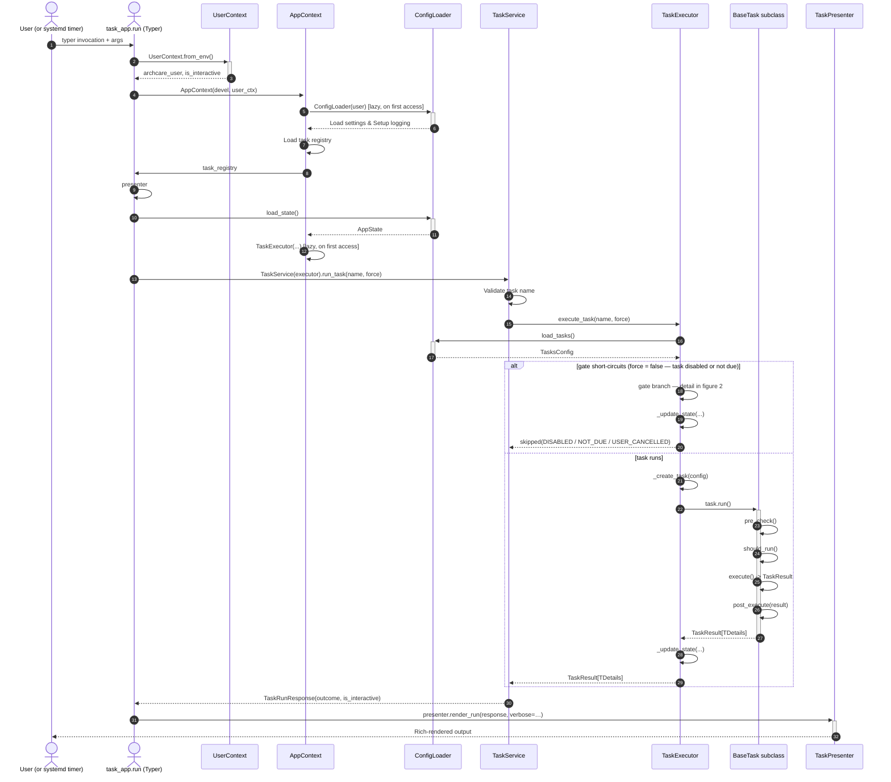
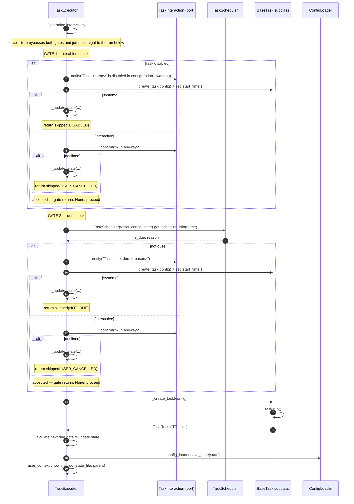
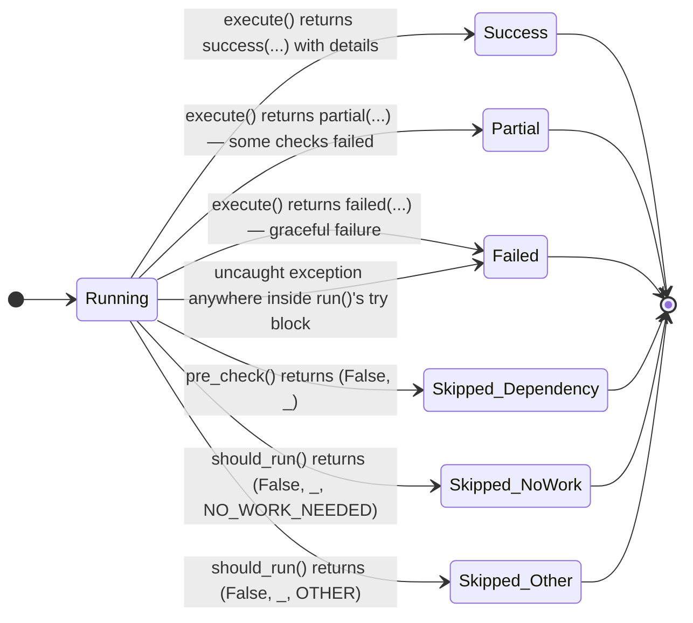

# Task Execution Lifecycle

This page traces what happens between `archcare task run <name>` and the row that lands in
`state.json` afterward — the full pipeline from shell to disk, the contract every concrete task
honors, and how a single run's outcome is classified.

If you have just read [Architecture Overview](index.md), this is the deep-dive companion:
overview explains _what the layers are_, this page explains _what runs inside them_.

## Diagram conventions

- All diagrams on this page are [Mermaid](https://mermaid.js.org/).
- Diagrams sit immediately above the section they illustrate and are referenced by name in the prose
  (e.g., "see _figure 1_").
- Actor and participant names match the source code (e.g., `TaskService`, `TaskExecutor`,
  `BaseTask`, `TaskResult`) so a reader can map every arrow onto a class in the API reference.

## From CLI command to state file

A `task run` begins as a shell invocation, but by the time it reaches executor code it has already
been through Typer's argument parser, a root callback that resolved the
[`UserContext`][archcare.config.user.UserContext] and built an
[`AppContext`][archcare.cli.context.AppContext], and a thin Typer command function
([`run`][archcare.cli.commands.task.run]) that constructs a fresh
[`TaskService`][archcare.services.task_service.TaskService] from the shared context and delegates
rendering to
[`TaskPresenter.render_run()`][archcare.cli.presenters.task_presenter.TaskPresenter.render_run].
All the actual work happens in between, inside [`TaskExecutor`][archcare.core.executor.TaskExecutor]
— whose internal gating and branching is broken out separately in _figure 2_ below.

See _figure 1_ for the full sequence.



- The vertical "swimlane" grouping (`CLI` / `TaskService` / `TaskExecutor` / `BaseTask`) mirrors
  the layered architecture — this _is_ what the layering looks like at runtime, not just at
  import time.

- `UserContext.from_env()` resolves `archcare_user` and the `is_interactive` flag that drives every
  later branching decision.

- `AppContext` is built once per invocation; [`ConfigLoader`][archcare.config.loader.ConfigLoader]
  is lazily constructed on first property access and cached for the rest of the run — so the "load
  TasksConfig / AppState" arrows all go through the same `ConfigLoader` instance.

- The `force` flag on the CLI bypasses both the disabled/due prompts (in interactive mode) and the
  auto-skip (in headless systemd mode) — but the task still runs through every hook below.

- The gate branch (only reached when `force = false` and the task is disabled or not due) behaves
  differently by environment. In a headless systemd-timer run the executor short-circuits with a
  `skipped(...)` carrying `SkipReason.DISABLED` or `SkipReason.NOT_DUE`. In an interactive run the
  user is prompted through the `TaskInteraction` port instead — declining produces
  `skipped(USER_CANCELLED)`, accepting falls through into a full run. See _figure 2_ for the
  branch-level detail.

- `_update_state` writes through the loader (rather than touching `state.json` directly), so all
  file I/O goes through the same layer boundary as the read. The `_update_state` write is the
  **last** step inside `EX`, so a crash in the presenter cannot corrupt state. The user sees Rich
  only after the state file has already been written.

## Inside the executor: gates and branching

Figure 1 deliberately keeps the executor as a few opaque arrows — the full `execute_task` branching
would not fit legibly on the end-to-end diagram. _Figure 2_ zooms into
[`TaskExecutor.execute_task()`][archcare.core.executor.TaskExecutor.execute_task] alone: the two
gates that can stop a run before a single task hook fires, and the environment-dependent behavior
of each.



- `is_systemd` is derived as `not user_context.is_interactive` — a run is treated as headless
  exactly when `ARCHCARE_USER` is set. That single flag selects the branch inside each gate.

- Each gate returns `TaskResult | None`: a result means "stop here, persist it, and return"; `None`
  means "proceed". This is why an accepted "Run anyway?" prompt simply falls through — there is no
  result to persist and no state change to record. The prompts themselves go through the
  [`TaskInteraction`][archcare.core.interaction.TaskInteraction] port (the CLI implementation is
  [`CliInteraction`][archcare.cli.interaction.CliInteraction]; core defaults to
  [`NonInteractive`][archcare.core.interaction.NonInteractive]).

- The gate helpers instantiate the task (`_create_task` + `set_start_time`) even on the skip path,
  because every returned `TaskResult` is finalized through `task.create_result()`, which stamps
  `duration_seconds` — a skip still records how long the decision took.

- Every exit path — gate skip or full run — passes through `_update_state` (which internally ends
  with `chown_if_root`) before control returns to
  [`TaskService`][archcare.services.task_service.TaskService], so `state.json` always reflects the
  last attempt regardless of outcome.

## The `BaseTask` contract

Every concrete task subclasses [`BaseTask`][archcare.core.base_task.BaseTask] and customizes five
hooks. [`BaseTask.run`][archcare.core.base_task.BaseTask.run] is the template method that calls them
in order; subclasses never override `run()` itself.

### [`pre_check`][archcare.core.base_task.BaseTask.pre_check] — environment prerequisites

```python
def pre_check(self) -> tuple[bool, str]: ...
```

Returns `(can_run, reason)`. A `False` return causes
[`BaseTask.run`][archcare.core.base_task.BaseTask.run] to short-circuit with a
[`skipped`][archcare.core.models.skipped] result and `SkipReason.DEPENDENCY_FAILED`.

`pre_check` is for _static_ environment prerequisites that don't change between runs: external
binaries on `PATH`, sudo availability, mounted filesystems, presence of `/etc/pacman.d/mirrorlist`,
etc.

Example: `MirrorlistUpdateTask` verifying that `reflector` is installed before doing anything else.

### [`should_run`][archcare.core.base_task.BaseTask.should_run] — dynamic runtime decision

```python
def should_run(self) -> tuple[bool, str, SkipReason | None]: ...
```

Returns `(should_run, reason, skip_reason)`. A `False` return short-circuits with
[`skipped`][archcare.core.models.skipped] carrying the supplied
[`SkipReason`][archcare.config.enums.SkipReason].

`should_run` is for _runtime_ decisions: did the task find any work to do? Should it
report something or quietly stand down?

Example: `FailedServicesTask` finding zero failed systemd units and returning
`SkipReason.NO_WORK_NEEDED`.

### [`execute`][archcare.core.base_task.BaseTask.execute] — the work itself

```python
@abstractmethod
def execute(self) -> TaskResult[Any]: ...
```

Abstract. Must return a [`TaskResult`][archcare.core.models.TaskResult] (`TaskResult[TDetails]`).
Build the result with one of the four factory functions in [`archcare.core.models`][]:

| Factory                                   | Status    | Use when                                                                      |
| ----------------------------------------- | --------- | ----------------------------------------------------------------------------- |
| [`success`][archcare.core.models.success] | `SUCCESS` | Work completed; populate `details` with typed findings.                       |
| [`failed`][archcare.core.models.failed]   | `FAILURE` | The task ran and decided it failed (no rollback fires).                       |
| [`partial`][archcare.core.models.partial] | `PARTIAL` | Some checks passed, others failed; treat as non-zero exit but a recorded run. |
| [`skipped`][archcare.core.models.skipped] | `SKIPPED` | Rare from inside `execute()`; the hooks above are the usual skip path.        |

!!! note "Graceful `failed(...)` vs uncaught exception"

    Both produce the same final `TaskStatus.FAILURE`, but only an uncaught exception triggers
    `rollback()`. If your task wants to _try to undo changes on a graceful failure_, you must do
    it inside `execute()` and return `failed(...)` — `rollback()` will not fire. `rollback()` is
    reserved for changes that otherwise would leave the system in an inconsistent state, such as
    a broken pacman mirrorlist.

### [`post_execute`][archcare.core.base_task.BaseTask.post_execute] — follow-up on every terminal path

```python
def post_execute(self, result: TaskResult[Any]) -> None: ...
```

Runs after a successful _or_ failed `execute()` (but before the logging teardown). Use it for
analytics, sending a desktop notification, or cleaning up report files. `post_execute` does **not**
run after a `pre_check()`/`should_run()` skip — those return before the hook is reached.

### [`rollback`][archcare.core.base_task.BaseTask.rollback] — exception-path recovery only

```python
def rollback(self) -> None: ...
```

Auto-invoked by [`BaseTask.run`][archcare.core.base_task.BaseTask.run] _only_ when `execute()`
raises an uncaught exception. Restore backups, remove partially-written files, revert permissions
— whatever the stateful side effects need.

If `rollback` itself raises, the exception is logged at `critical` level but does **not** mask the
original failure: the final result returned to the executor is still a
`failed("Task execution failed: …", error=…)` produced by `run()`'s `except` branch.

## [`run`][archcare.core.base_task.BaseTask.run] — orchestration

`BaseTask.run` executes the full pipeline. In order:

1. `set_start_time()` — capture the start timestamp for duration metrics.

2. [`setup_task_logging`][archcare.config.setup_task_logging] — install a per-task rotating file
   handler under `~/.local/state/archcare/logs/tasks/` (always at DEBUG level, regardless of the
   global `log_level`).

3. Inside a `logger.contextualize(task=self.name)` block:
    - **`pre_check()`** — return `skipped(...)` with `SkipReason.DEPENDENCY_FAILED` if it returns
      `(False, _)`.
    - **`should_run()`** — return `skipped(reason, skip_reason)` if it returns `(False, _, reason)`.
    - **`execute()`** — capture the returned `TaskResult[TDetails]`.
    - **`post_execute(result)`** — run regardless of outcome.

4. Log a `success` / `error` / `info` line depending on `result.status`.

5. On any uncaught exception inside the contextualize block:
    - `logger.exception(...)` — full traceback.
    - `rollback()` — best-effort; failures logged at `critical`.
    - Return `failed("Task execution failed: <e>", error=str(e))`.

6. **`finally:`** — remove the task log handler and `progress.stop()`.

The flow exits with one of the six terminal states shown in _figure 3_ below.

## State persistence

After `task.run()` returns, `TaskExecutor` calls `TaskExecutor._update_state` (a private method)
to persist the outcome:

- `state.update_task_state(...)` writes `status`, `error`, `skip_reason`, and the new `next_due`
  for the task.

- `config_loader.save_state(state)` dumps the whole [`AppState`][archcare.config.models.AppState]
  to `~/.local/state/archcare/state.json`.

- If running as root via a systemd timer,
  [`UserContext.chown_if_root`][archcare.config.user.UserContext] fixes ownership of the file (and
  its parent directory) back to the target user resolved from `ARCHCARE_USER`.

`TaskExecutor._calculate_next_due` (also private) controls what `next_due` becomes:

| Terminal `status`                    | New `next_due`                                 |
| ------------------------------------ | ---------------------------------------------- |
| `SUCCESS` / `PARTIAL`                | `now() + frequency days` — schedule advances.  |
| `SKIPPED` with `SkipReason.DISABLED` | `None` — disabled tasks have no schedule.      |
| `SKIPPED` (any other reason)         | preserved — skipped tasks don't slide forward. |
| `FAILURE`                            | preserved — failed tasks don't slide forward.  |

The [Configuration & state](configuration.md) page walks the
[`AppState`][archcare.config.models.AppState] schema in detail.

## Outcomes and why this shape

A single task run ends in exactly one of six terminal states. See _figure 3_.



- **Two distinct paths into `Failed`** are the part most contributors miss. A _graceful_
  [`failed`][archcare.core.models.failed] return means the task decided it failed; no rollback fires
  and no critical log is written. An _uncaught exception_ triggers `rollback()` and produces
  `failed("Task execution failed: …", error=…)`. Both reach the same final state and exit code, but
  the executor's behavior diverges: notification level, log severity, and whether side effects were
  attempted to be reverted.

- **`SKIPPED` is three states, not one.** The [`SkipReason`][archcare.config.enums.SkipReason]
  classifier is what distinguishes them, and `archcare task status --due` and the
  `maintenance-check` task treat them differently:
    - `DEPENDENCY_FAILED` signals a configuration problem (binary missing, permissions wrong) —
      surfaced as a maintenance issue.
    - `NO_WORK_NEEDED` means "ran, found nothing to do" — not a problem, normal idle output.
    - `DISABLED`, `NOT_DUE`, `USER_CANCELLED` are scheduling decisions, not maintenance problems.
      Note that these three are decided by the executor's gates (figure 2) _before_ `run()` is ever
      invoked — only `DEPENDENCY_FAILED` and `should_run` rejections originate inside the task
      pipeline that figure 3 models.

- **Why this shape** — the three-axis separation earns its keep:
    - `pre_check` vs `should_run` keeps _environment_ failures distinct from _runtime_ "nothing
      to do" outcomes — useful for alerts.
    - Rollback only fires on uncaught exceptions because a graceful `failed(...)` already implies
      the task decided what to do; firing rollback there would double-handle errors.
    - `post_execute` runs on failure (but not on skip) so the user still gets a desktop notification
      when something breaks — but isn't spammed when a task merely stood down.

For the per-task-detail schemas that populate the `details` field on each terminal state, see
[`archcare.core.task_details`][] in the API reference.

## Related pages

- [Architecture Overview](index.md) — the layered design and why the layers exist.
- [Registry, ports & extensibility](registry-and-ports.md) — how a task's class is found, and how
  the CLI/GUI seam works.
- [Configuration & state](configuration.md) — the [`AppState`][archcare.config.models.AppState]
  schema and TOML loading.
- [Adding a new task](../guides/adding-a-task.md) — a worked example implementing every hook above.
